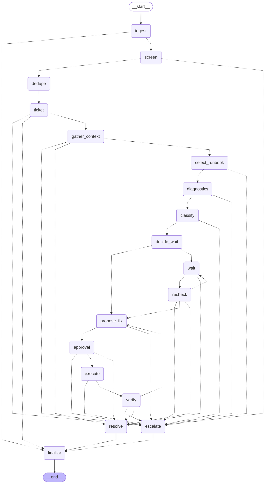

# The workflow graph

Generated from the code by `uv run python -m creo.agent.graph`;
a test checks it is current.
Model calls happen only at `classify` (runbooks with judgement) and `escalate`.

```mermaid
---
config:
  flowchart:
    curve: linear
---
graph TD;
	__start__([<p>__start__</p>]):::first
	ingest(ingest)
	screen(screen)
	dedupe(dedupe)
	ticket(ticket)
	gather_context(gather_context)
	select_runbook(select_runbook)
	diagnostics(diagnostics)
	classify(classify)
	decide_wait(decide_wait)
	wait(wait)
	recheck(recheck)
	propose_fix(propose_fix)
	approval(approval)
	execute(execute)
	verify(verify)
	resolve(resolve)
	escalate(escalate)
	finalize(finalize)
	__end__([<p>__end__</p>]):::last
	__start__ --> ingest;
	approval -.-> escalate;
	approval -.-> execute;
	approval -.-> resolve;
	classify -.-> decide_wait;
	classify -.-> escalate;
	decide_wait -.-> propose_fix;
	decide_wait -.-> wait;
	dedupe -.-> ticket;
	diagnostics -.-> classify;
	diagnostics -.-> escalate;
	escalate -.-> finalize;
	execute -.-> escalate;
	execute -.-> verify;
	gather_context -.-> escalate;
	gather_context -.-> resolve;
	gather_context -.-> select_runbook;
	ingest -.-> finalize;
	ingest -.-> screen;
	propose_fix -.-> approval;
	propose_fix -.-> escalate;
	recheck -.-> escalate;
	recheck -.-> propose_fix;
	recheck -.-> resolve;
	recheck -.-> wait;
	resolve -.-> finalize;
	screen -.-> dedupe;
	screen -.-> escalate;
	select_runbook -.-> diagnostics;
	select_runbook -.-> escalate;
	ticket -.-> escalate;
	ticket -.-> finalize;
	ticket -.-> gather_context;
	verify -.-> escalate;
	verify -.-> propose_fix;
	verify -.-> resolve;
	wait -.-> recheck;
	wait -.-> resolve;
	finalize --> __end__;
	classDef default fill:#f2f0ff,line-height:1.2
	classDef first fill-opacity:0
	classDef last fill:#bfb6fc
```
